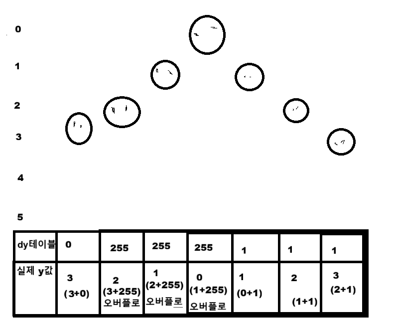
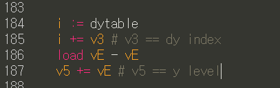
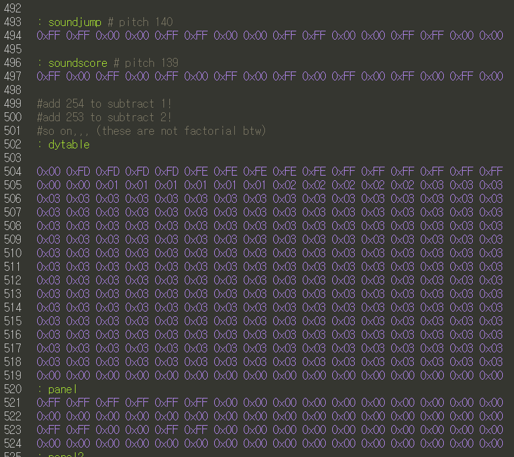
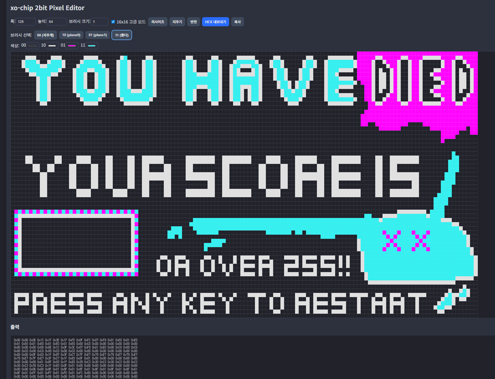

# my-first-emulator
My first **CHIP-8** and **SUPER-CHIP** and **XO-CHIP** emulator

Try [**HERE**](https://sankim05.github.io/my-first-emulator/)

[**지금 바로 실행**](https://sankim05.github.io/my-first-emulator/)

## Information
Yup, this is a **CHIP-8** and some extensions emulator(interpreter actually) made entirely on javascript and stuffs.

자바스크립트로 만든 **CHIP-8** 에뮬레이터(사실 인터프리터에 가깝죠.)입니다. 확장팩도 지원합니다.

.png "you can see its inside")

You can see stuffs inside it and do some stuffs also.

I also made a game on **XO-CHIP** to provide test rom and assert dominance.

테스트용 롬으로 **XO-CHIP** 게임도 만들었답니다.

## Adventure Of Thorg

**Adventure Of Thorg** is a CGA-style game that i made for XO-CHIP.

**Adventure Of Thorg**은 CGA 스타일의 XO-CHIP 게임입니다.

Made using [Octo IDE](https://github.com/JohnEarnest/Octo).
Also including original **8o File** so you can watch its inside.

[Octo IDE](https://github.com/JohnEarnest/Octo)로 만들어졌고 
충분히 씹고뜯고맛보고즐기고 하실수 있게 원본 **8o 파일**도 첨부합니다.

<video controls width="500">
  <source src="./readmestuffs/huhvideo.mp4" type="video/mp4">
</video>

Move left and right, and jump pressing 7,9,5 in keypad (wasd in your keyboard).

You die when you fall off platform.

조작은 키패드의 7,9,5 버튼 또는 wasd입니다.

떨어지는 플랫폼 사이의 구멍을 통해 점프해서 살아남으세요.

### A cool trick that i found during development
you know its hard to implement realistic gravity with accelerations and real life physics in 8-bit machine.

8비트 머신에서 실제 중력효과를 구현하기는 힘들지요.

I found and used the ol'reliable **"dy table"** trick to apply gravity after jumping, falling off from platforms.

그래서 제가 발견한(바퀴의 재발명!) **"dy 테이블"** 기법을 사용해서 해결했습니다.

Whenever you are jumping or falling off a platform(start from decreasing point), you just iterate through a table that stores data of y coord increment number as time flows. then add that number to actual y coords to make character move up and down.

점프를 하거나 플랫폼에서 떨어질 때(이 경우 떨어지는 시점에서 시작함), y 증가값 데이터가 담긴 테이블을 시간에 따라 순회하면서 캐릭터의 y 레벨을 변화시킵니다.

And coolest part is, you can actually just store **255 or other big number** at table to decrement that y level(in our game character goes up) since it will just **overflow** when added with single instruction. so you can just do this without having to have separate code and having to write complex code to make gravity system for increasing half and decreasing half(the height of character after jumping).

가장 멋진 부분은 그냥 테이블에 **255나 다른 충분히 큰 숫자**를 넣어놓으면, 그냥 간단한 덧셈 연산으로 더했을때 **오버플로우**되어 1 감소하는 효과가 나오는 것이죠. 이렇게 되면 그냥 테이블 초반에 255를 넣어 -1되는 효과(y레벨이 감소하면서 캐릭이 실제로 떠오름)를 주고 후반에 1을 넣어 캐릭이 감소하는 효과를 줄수있죠. 이러면 이제 점프후 증가 > 떨어짐을 구현할때 복잡한 코드를 작성할 필요가 없습니다.

So i made these dy tables with pseudo-acceleration dy data so jump and gravity looks realistic. it jumps fast at first then stops at midair, then again falls fast by adding sightly bigger number to y level of character.

그래서 의사-가속도 데이터를 만들어, 점프할때 중력 효과가 있는거처럼 만들었죠. 점프하면 초기에는 빨리 올라가고 중간에는 0이 더해져서 그냥 멈추고, 다시 시간이 지나면 떨어지는 속도가 빨라진답니다.

### Ai assist (kinda?)

I also vibe coded a graphics tool that can help drawing big sprite and turn them into hex data. (Ai is good at front-end ig) then i used it to draw title screen and game over screen of gaem.

128x64 크기의 스크린 이미지를 hex 데이터 노가다로 1개씩 찍는 건 미친 짓이기 때문에, Ai로 바이브코딩해서 커다란 그림을 그리면 hex 데이터로 변환하게 해주는 툴을 만들었는데 ai가 이런건 잘하죠

## ???
https://youtu.be/3i5q2CSO53Q

